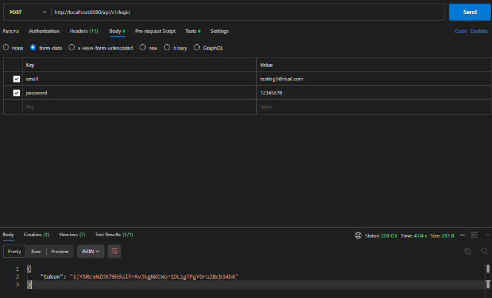

# Exercise Todolist RESTful API Using Sanctum API in Laravel 11
RESTful API for basic todolist using Sanctum API. For now, this project is still in development stage. The implementation results can be seen in the below.


## Prerequisite:

- Composer >= 2.8
- PHP >= 8.3


## Features

- Authentication With Token Based
- CRUD Todo Based User
- Error Logging Server (Can be seen in the database)


## Screenshots




## Run Locally

Clone the project

```bash
  git clone https://github.com/brianajiks123/Exercise-Laravel-11-Sanctum-Logging-API.git
```

Go to the project directory

```bash
  cd Exercise-Laravel-11-Sanctum-Logging-API
```

Install Dependencies (Laravel)

```bash
  composer install
```

Migrate Database (make sure already setup your environment in the .env file)

```bash
  php artisan migrate
```

Running Development

```bash
  php artisan serve
```


## Testing Using API Client (Such as Postman)

### Routes

#### Auth
- POST http://localhost:8000/api/v1/register
- POST http://localhost:8000/api/v1/login
- GET http://localhost:8000/api/v1/user
- POST http://localhost:8000/api/v1/logout

#### Todolist
- GET http://localhost:8000/api/v1/todos
- POST http://localhost:8000/api/v1/todo
- GET http://localhost:8000/api/v1/todo/{id}
- PUT http://localhost:8000/api/v1/todo/{id}
- DELETE http://localhost:8000/api/v1/todo/{id}


## API Reference

Headers:
- Accept: application/json

### Auth

#### Register

```http
  POST /api/v1/register
```

| Body                 | Type       | Description                       |
| :------------------- | :-------   | :-------------------------------- |
| `name`               | `string`   | **Required**                      |
| `email`              | `email`    | **Required**. Valid email         |
| `password`           | `password` | **Required**. Min. 8 characters   |

#### Login

```http
  POST /api/v1/login
```

| Body                 | Type       | Description                       |
| :------------------- | :-------   | :-------------------------------- |
| `email`              | `email`    | **Required**. Valid email         |
| `password`           | `password` | **Required**. Min. 8 characters   |

#### Get User Profile

Authorization:
- Bearer Token: auth token

```http
  GET /api/v1/user
```

#### Logout

Authorization:
- Bearer Token: auth token

```http
  POST /api/v1/logout
```

### CRUD Todolist

Authorization:
- Bearer Token: auth token

#### Add Todo

```http
  POST /api/v1/todo
```

| Body                 | Type      | Description                           |
| :------------------- | :-------  | :--------------------------------     |
| `title`              | `string`  | **Required**. Max. 100 chararacters   |
| `description`        | `text`    | **Required**. Max. 200 characters     |
| `is_done`            | `boolean` | **Required**. 0 OR 1                  |

#### Get Todolist

```http
  GET /api/v1/todos
```

#### Get Spesific Todo

```http
  GET /api/v1/todo/{id}
```

| Params                 | Type      | Description                |
| :-------------------   | :-------  | :------------------------- |
| `id`                   | `integer` | **Required**. Id of item   |

#### Update Todo

```http
  PUT /api/v1/todo/{id}
```

| Params                 | Type      | Description                |
| :-------------------   | :-------  | :------------------------- |
| `id`                   | `integer` | **Required**. Id of item   |

| Body                 | Type      | Description                           |
| :------------------- | :-------  | :--------------------------------     |
| `title`              | `string`  | **Required**. Max. 100 chararacters   |
| `description`        | `text`    | **Required**. Max. 200 characters     |
| `is_done`            | `boolean` | **Required**. 0 OR 1                  |

#### Delete Todo

```http
  PUT /api/v1/todo/{id}
```

| Params                 | Type      | Description                |
| :-------------------   | :-------  | :------------------------- |
| `id`                   | `integer` | **Required**. Id of item   |


## Error Logging Server


## Tech Stack

**Server:** Laravel 11, Sanctum API, MySQL, Git, Apache Web Server, Postman, VS Code, Windows 11


## Acknowledgements

 - [Laravel](https://laravel.com/docs/11.x)


## Authors

- [@brianajiks123](https://www.github.com/brianajiks123)
